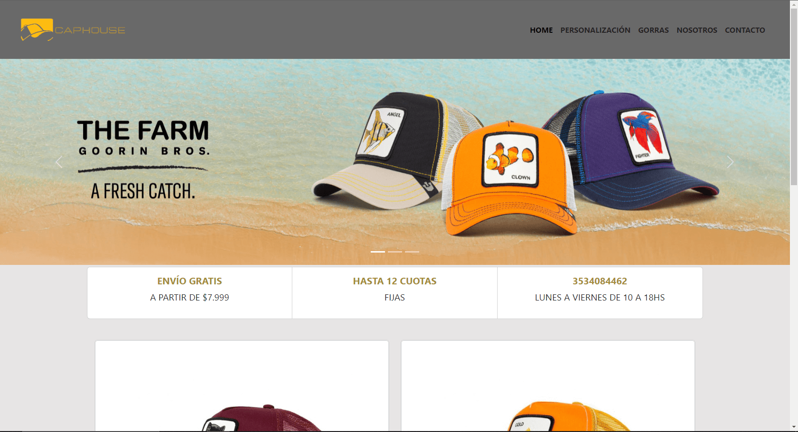
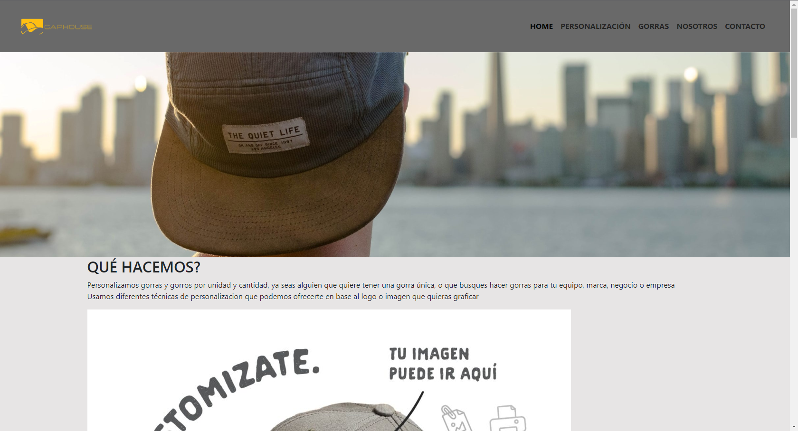
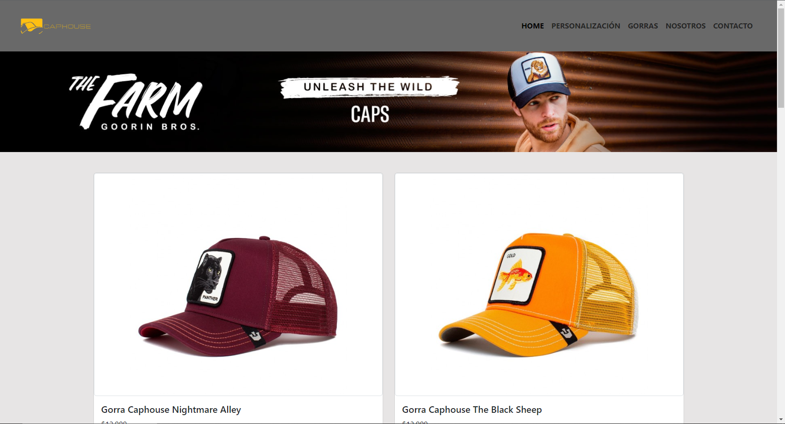
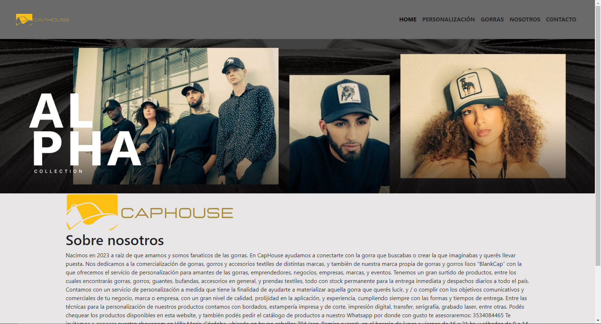
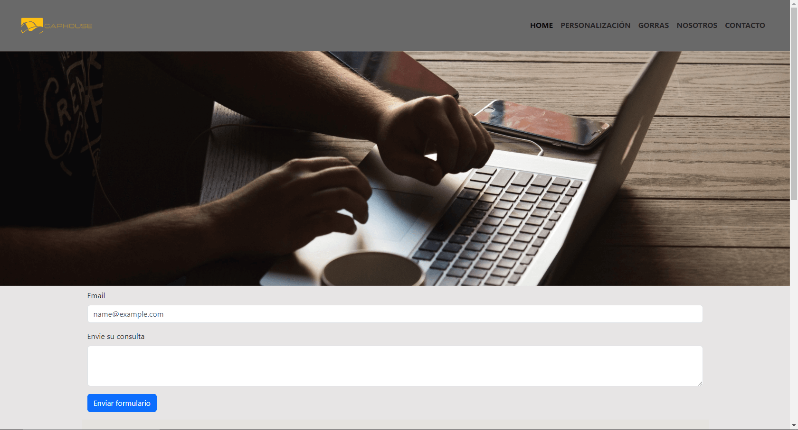

# Pre-entrega 2 para el curso de coderhouse (Responsive) con Bootstrap 5

Este proyecto creado para el curso de desarrollador full stack, es una página web adaptable a dispositivos de distintos tamaños (este tipo de sitio web se conoce en inglés como "responsive").

El propósito de esta página web es mostrar el uso de boostrap5 utilizando diferentes breakpoints para que se adapte a distintos tipos de pantallas como un smartphone, laptop o dekstop. Incluye una seccion principal donde se muestra el producto, y luego el tipo de personalizacion que aplicamos a diferentes gorras, la variedad, un formulario de contacto y donde estamos ubicados (cabe aclarar que es una pagina sin fines de lucros y totalmente para uso estudiantil).

También incluye imágenes a modo de ilustracion sobre los productos en la carpeta `imagenes`.

### Capturas de pantalla:

Personalizacion:

Gorras:

Nosotros:

Contacto:

